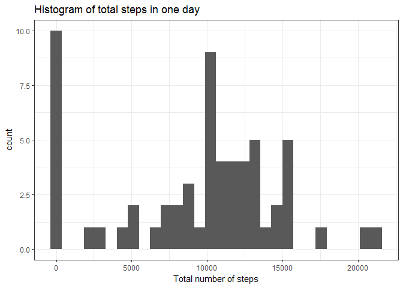
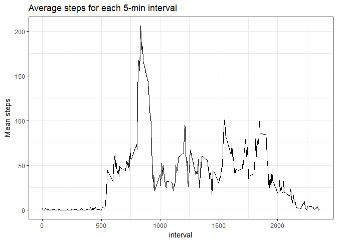
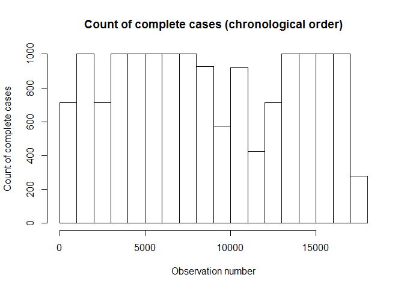
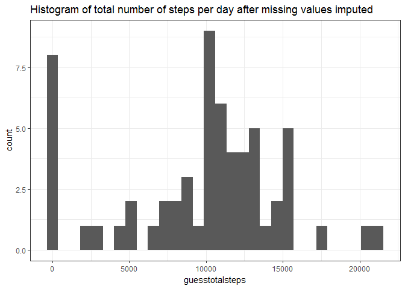
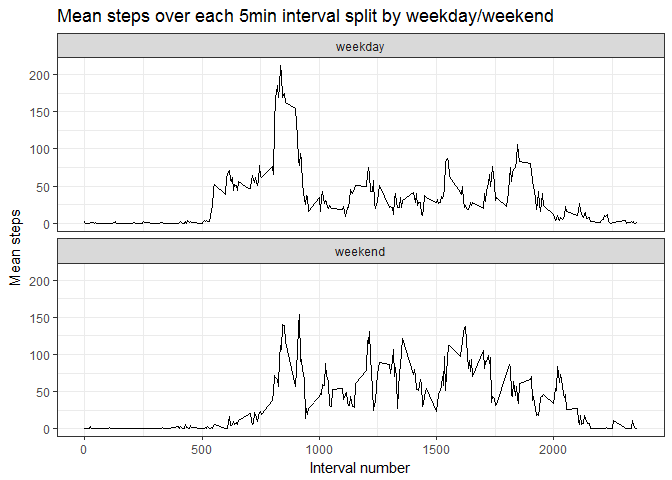

Setting up the Global Options and loading required libraries:

    knitr::opts_chunk$set(echo = TRUE)
    library(plyr)
    library(ggplot2)

Loading and preprocessing the data
----------------------------------

    #read in
    activity<-read.csv("activity.csv",colClasses=c("integer","Date","integer"))
    #q1
    stepsperday<-ddply(activity, c("date"),summarise,
                       totalsteps=sum(steps,na.rm=TRUE)
                       )
    #q2
    stepsper5min<-ddply(activity, c("interval"),summarise,
                        meansteps = mean(steps,na.rm=TRUE)
                        )

What is the mean total number of steps taken per day?
-----------------------------------------------------

The mean total number of steps taken per day is 9354.2295082. The median
number of steps taken per day is 10395(NA's omitted).

    stepshist<-ggplot(stepsperday,aes(x=totalsteps))+geom_histogram()+
      xlab("Total number of steps")+
      ggtitle("Histogram of total steps in one day")+
      theme_bw()
    print(stepshist)

    ## `stat_bin()` using `bins = 30`. Pick better value with `binwidth`.

What is the average daily activity pattern? 
-------------------------------------------

    dayline<-ggplot(stepsper5min,aes(x=interval,y=meansteps))+geom_line()+
      ggtitle("Average steps for each 5-min interval")+
      ylab("Mean steps")+
      theme_bw()
    print(dayline)

The five minute interval with the highest mean step-count is interval \#
835 with a mean of 206.1698113 steps.

Imputing missing values
-----------------------

There are 2304 incomplete records, unevenly distributed through the
data.

    hist(which(complete.cases(activity)),
         main="Count of complete cases (chronological order)",
         xlab="Observation number",
         ylab="Count of complete cases"
         )

Interpolation is done by using the average of the previous valid
observation and the next valid observation, or the average for the
relevant 5-min interval if there is no valid previous/next observation.
This produces smooth activity-over-the-day lines for each individual
day, but is not very fast.

    #q3
    step_interpolation <- function(rownumber){
      prevrow=rownumber;
      nextrow=rownumber;
      while(is.na(activity$steps[prevrow])){
        prevrow=prevrow-1
        if(prevrow<1)return(mean(activity[activity$interval==activity$interval[rownumber],"steps"],na.rm=TRUE))
      }
      while(is.na(activity$steps[nextrow])){
        nextrow=nextrow+1
        if(nextrow>nrow(activity))return(mean(activity[activity$interval==activity$interval[rownumber],"steps"],na.rm=TRUE))
      }
      return(
        (activity$steps[prevrow]+activity$steps[nextrow])/2
      )
    }

    activity_guessNA <-activity
    for(n in 1:nrow(activity)){
      if(is.na(activity$steps[n])){
        activity_guessNA$steps[n]=step_interpolation(n);
      }
    }

Histogram after the missing values have been imputed

    stepsperday2<-merge(
      ddply(activity_guessNA, c("date"),summarise,
            guesstotalsteps=sum(steps,na.rm=TRUE)
      ),
      stepsperday,
      by="date"
    )

    hist<-ggplot(stepsperday2,aes(x=guesstotalsteps))+
        geom_histogram()+
      ggtitle("Histogram of total number of steps per day after missing values imputed")+
        theme_bw()
    print(hist)

    ## `stat_bin()` using `bins = 30`. Pick better value with `binwidth`.

The mean and median total steps are 9354.2295082 and 10395, for the
NA-imputed data the mean and median are 9707.219301 and 1.057110^{4}.

Are there differences in activity patterns between weekdays and weekends?
-------------------------------------------------------------------------

It looks like activity is higher on the weekends, particularly in the
middle of the day, although it is lower early in the morning just after
waking.

    paindays= c("Monday","Tuesday","Wednesday","Thursday","Friday")

    activity_guessNA$weekday<-as.factor(ifelse(weekdays(activity_guessNA$date)%in%paindays,"weekday","weekend"))

    stepsperinterval.weekdaysplit<-ddply(activity_guessNA, c("interval","weekday"),summarise,
                        meansteps = mean(steps,na.rm=TRUE)
    )

    weekdayplot<-ggplot(stepsperinterval.weekdaysplit,aes(x=interval,y=meansteps))+
      facet_wrap(~weekday,nrow=2,ncol=1)+
      geom_line()+
      theme_bw()+
      ggtitle("Mean steps over each 5min interval split by weekday/weekend")+
      ylab("Mean steps")+
      xlab("Interval number")
    print(weekdayplot)

